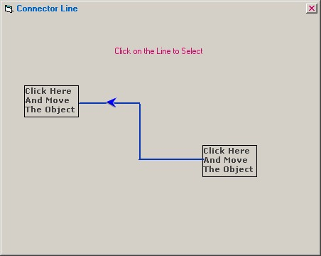



## Connector Line with Arrow

### Description

The connector line draws three lines between two controls(here label). The user can change the control type if they want to. The connector line change its position whenever a control is moved. It supports runtime control movement and line position.
 
### More Info
 

             |
---                |---
**Submitted On**   |2002-10-18 16:52:12
**By**             |[Senthamil](https://github.com/Planet-Source-Code/PSCIndex/blob/master/ByAuthor/senthamil.md)
**Level**          |Intermediate
**User Rating**    |4.9 (68 globes from 14 users)
**Compatibility**  |VB 6\.0
**Category**       |[Graphics](https://github.com/Planet-Source-Code/PSCIndex/blob/master/ByCategory/graphics__1-46.md)
**World**          |[Visual Basic](https://github.com/Planet-Source-Code/PSCIndex/blob/master/ByWorld/visual-basic.md)
**Archive File**   |[Connector\_14838910192002\.zip](https://github.com/Planet-Source-Code/senthamil-connector-line-with-arrow__1-39954/archive/master.zip)

